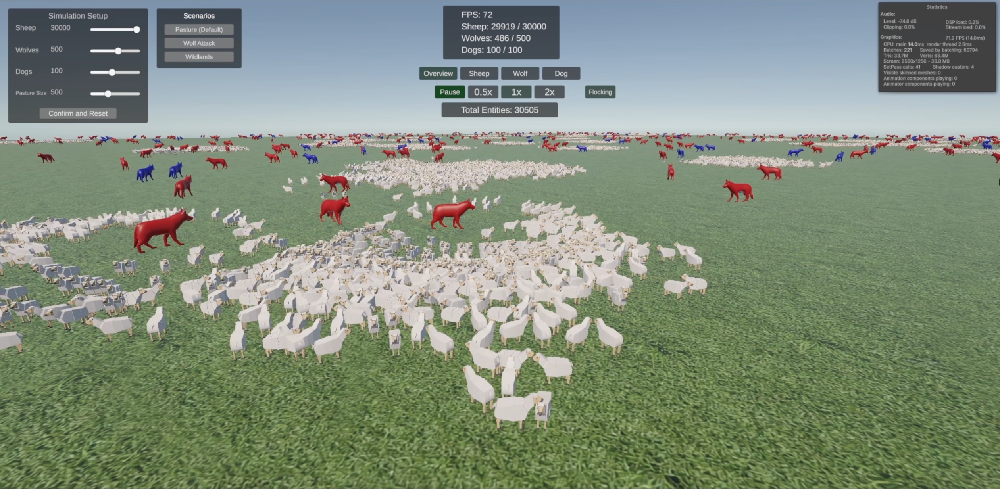

 

<h3 align="center">Large-Scale Agent Simulation</h3>

<!-- TABLE OF CONTENTS -->

  
Table of Contents

  <ol>
    <li>
      <a href="#about-the-project">About The Project</a>
      <ul>
        <li><a href="#built-with">Built With</a></li>
      </ul>
    </li>
    <li>
      <a href="#getting-started">Getting Started</a>
      <ul>
        <li><a href="#prerequisites">Prerequisites</a></li>
        <li><a href="#installation">Installation</a></li>
      </ul>
    </li>
    <li><a href="#usage">Usage</a></li>
    <li><a href="#roadmap">Roadmap</a></li>
    <li><a href="#contact">Contact</a></li>
    <li><a href="#acknowledgments">Acknowledgments</a></li>
  </ol>

<!-- ABOUT THE PROJECT -->
## About The Project

A Unity 6 simulation of 50,000+ independently moving (and interacting) agents, built to explore the performance challenges of large-scale real-time agent simulation.

Each agent (Sheep, Wolf, Dog) is stored as a struct instead of a Unity GameObject to decrease overhead. Spatial partitioning hash maps allow agents to locate other agents while avoiding O(n^2) lookups. Agents' movement and interactions use Unity's job system to process actions for tens of thousands of agents in parallel across multiple CPU cores. The simulation uses a fixed-step system that updates agent behavior at 30 steps per second independently of the rendering frame rate. To render 3D models for 50,000+ agents efficiently, GPU instancing is used.

Sheep have Boids-like flocking behavior. They prefer to be near a large flock of other sheep, but not too close to any individual sheep. They run away when a Wolf is near them. Sheep detect and count nearby Sheep, and detect nearby Wolves, using data from the spatial hash maps (one per agent type) to make movement decisions. Sheep movement reactions are implemented using vector math. These actions are made more efficient by Unity's job system processing them in parallel for tens of thousands of sheep. The "current" and "next" Sheep state arrays allow the Sheep actions to occur safely in parallel. Wolves and Dogs similarly use Unity's job system along with the spatial hash maps and vector math to process movement.

Wolves search for and chase sheep, and when they catch one, the sheep is "lost" and disappears. Wolves run from Dogs.

Dogs search for and chase Wolves, and when they catch one, the Wolf is "lost" and disappears.

(<a href="#readme-top">back to top</a>)

### Demo

[Watch the demo video on YouTube](https://youtu.be/aANr7i0Nh2w)

(<a href="#readme-top">back to top</a>)

### Built With

* [![Unity][Unity.com]][Unity-url]
* [![C#][CSharp.com]][CSharp-url]
* [![URP][URP.com]][URP-url]
* [![Unity Jobs][UnityJobs.com]][UnityJobs-url]
* [![Burst][Burst.com]][Burst-url]

(<a href="#readme-top">back to top</a>)

<!-- GETTING STARTED -->
## Getting Started

Follow these steps to run the simulation locally.

### Prerequisites

Before running, make sure you have:
* [Unity 6](https://unity.com/releases/unity-6)

### Installation

1. Clone the repository.
2. Open the project in Unity.
3. The project should automatically open the "HerdArea" scene. If it doesn't, open Assets -> Scenes -> HerdArea.
4. Press the "Play" button to start the simulation.

(<a href="#readme-top">back to top</a>)

<!-- USAGE EXAMPLES -->

## Usage

### Camera Controls

* **W / A / S / D** - Move the camera.
* **Q / E** - Move the camera up and down.
* **Right Mouse Button + Mouse** - Rotate the camera.
* **Sheep / Wolf / Dog** - Snap the camera to a random agent of that type.

### Custom Simulation

Use the **Simulation Setup** window to choose the number of Sheep, Wolves, and Dogs, then click **Confirm and Restart** to restart the simulation with those settings.

### Presets

Use the buttons in the **Simulations** window to choose from three interesting preset scenarios.

### Simulation Speed

Click the Pause / 0.5x / 1x / 2x buttons to change simulation speed.

### Flocking Setting

Click the "Flocking" button to disable or enable flocking. Disabling sheep flocking will make them no longer tend towards staying in flocks. This will improve performance slightly.

### FPS Notes

Tested at 2560×1440 on an AMD Ryzen 5 3600XT (6-core), AMD Radeon RX 5600 XT, and 16 GB RAM:

20,000+ entities: 100-110 FPS
35,000+ entities: ~50 FPS
50,000+ entities: ~40 FPS

To test a high sustained entity count, use max Sheep/Wolves and a low number of Dogs. Since Dogs quickly capture Wolves without stopping, the total entity count will be reduced rapidly with a high number of dogs.

(<a href="#readme-top">back to top</a>)

<!-- ROADMAP -->
## Roadmap

No current roadmap exists, except to fix any issues that come up.

(<a href="#readme-top">back to top</a>)

<!-- CONTACT -->
## Contact

Brett Brimmer - [LinkedIn](https://www.linkedin.com/in/brettbrimmer/) - BrettBrimmer@gmail.com

Project Link: [https://github.com/brettbrimmer/large-scale-agent-simulation](https://github.com/brettbrimmer/large-scale-agent-simulation)

(<a href="#readme-top">back to top</a>)

<!-- ACKNOWLEDGMENTS -->
## Acknowledgments

* README template based on [Best-README-Template](https://github.com/othneildrew/Best-README-Template) by othneildrew.

(<a href="#readme-top">back to top</a>)

<!-- MARKDOWN LINKS & IMAGES -->
[Unity.com]: https://img.shields.io/badge/Unity_6-000000?style=for-the-badge&logo=unity&logoColor=white
[Unity-url]: https://unity.com/
[CSharp.com]: https://img.shields.io/badge/C%23-239120?style=for-the-badge&logo=csharp&logoColor=white
[CSharp-url]: https://learn.microsoft.com/en-us/dotnet/csharp/
[URP.com]: https://img.shields.io/badge/Universal_Render_Pipeline-000000?style=for-the-badge&logo=unity&logoColor=white
[URP-url]: https://docs.unity3d.com/Manual/urp/urp-introduction.html
[UnityJobs.com]: https://img.shields.io/badge/Unity_Job_System-000000?style=for-the-badge&logo=unity&logoColor=white
[UnityJobs-url]: https://docs.unity3d.com/Manual/JobSystem.html
[Burst.com]: https://img.shields.io/badge/Burst_Compiler-000000?style=for-the-badge&logo=unity&logoColor=white
[Burst-url]: https://docs.unity3d.com/Packages/com.unity.burst@latest
